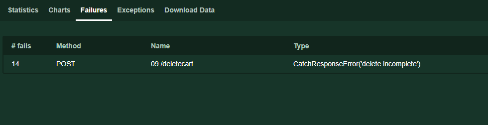

In this example we are going to buy a product from the [demo blaze shop](https://www.demoblaze.com) and in doing so, learn some more about how to do things in Locust.

*The full code for this example is [here](./examples/more_complex_example.py)

## Tasks, tasksets and sequential tasksets

Just as samplers can be grouped together with controllers in JMeter, so tasks can be grouped with tasksets and sequential tasksets.

Tasksets are used where the execution order isn’t important and sequential tasksets where it does matter. In this example, order matters so we are adding a sequential taskset.

```python
class MakePurchase(SequentialTaskSet):
```
Tasksets can also be nested in other tasksets and weight attributes can be set to determine the relative number of times each task is called. See the [documentation](https://docs.locust.io/en/latest/writing-a-locustfile.html#taskset-class) for more details.

## Start up/setup
JMeter has setUp and tearDown thread groups to carry out any initialisation activity (as well as pre and post processors), to do this in Locust, add an on_start function. In the example, we will need to provide a unique identifier.

```python
class MakePurchase(SequentialTaskSet):
def on_start(self):
    #make a unique purchase id for later use
    self.purchase_id = get_uuid()
```

## Making custom functions
The unique identifier for purchase id would normally be done by JavaScript running in the browser and to recreate this in JMeter, we may either use a built in function such as __UUID or make groovy script and add it as a pre-processor.

With Locust, we can make a function and then call it when we need it. In this case, we create a function get_uuid

```python
def get_uuid():
    #make a random string
    r_s = ''.join(random.choices(string.ascii_lowercase + string.digits, k=32))
    #turn it into a uuid
    uuid = r_s[:8] + "-" + r_s[8:12] + "-" + r_s[12:16] + "-" + r_s[16:20] + "-" + r_s[20:32]
    return uuid
```

## Naming requests
As with JMeter, where the name field of HTTP Request determines what will appear in the name field, you can also set the name for a request.
Add a name parameter to the request

```python
   @task
    def home(self):
        self.client.get("/", name ="01 /")
```

## Dealing with embedded resources
When requesting a page, you may also want to include requests to embedded resources. This doesn’t come as a standard feature in Locust, but there is a plugin in [locust plugins](https://github.com/SvenskaSpel/locust-plugins/).

Like Locust, Locust plugins can be installed using pip

```python
pip install locust-plugins
```
If you would like to learn how to include resources without using the plugin, an explanation is provided [here](./embedded_resource_example.md)

## Managing cookies and headers
Cookies are managed for you by default, which is like having the cookie manager in JMeter always included.

Both headers and cookies are stored as dictionaries in the session (referenced as self.client) and can be changed for all requests or any specific request.

Let’s look at an example where a cookie has to be created with a unique value by the client and sent in a request.

```python
#create random string using the function we made for purchase ids and add to cookies dictionary
self.client.cookies["user"] = get_uuid()
```

A similar approach can be taken for headers, however, in this case, the headers have been modified directly in a request:

```python
response = self.client.post(self.api_host + "/viewcart", payload, headers={"Content-Type": "application/json"},  name="08 /viewcart")
```

*To learn more about how cookies and headers are managed and manipulated, see the [requests page](https://requests.readthedocs.io/en/master/)

## Assertions
Assertions are made by setting catch_response to True when making a request and then evaluating the response. For example:
```python
with self.client.post(self.api_host + "/deletecart", catch_response=True) as response:
if response.content != b"Delete complete":
            	response.failure("delete incomplete")
```
When the response is marked as a failure, it is logged and presented in the failures tab



To learn about more features, see [here](./other_features.md)
