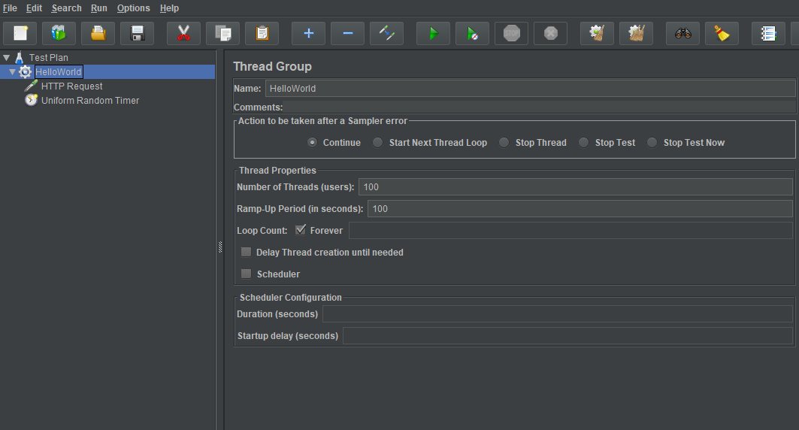
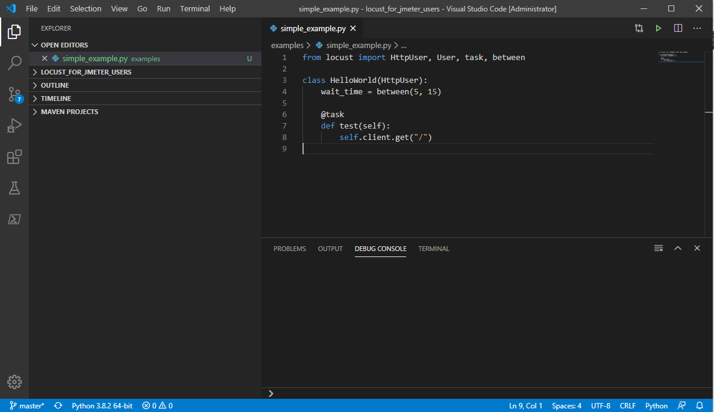
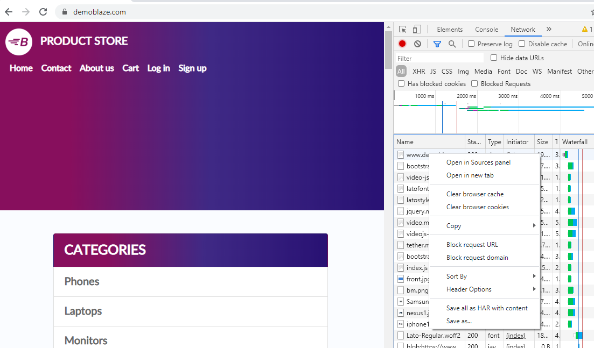
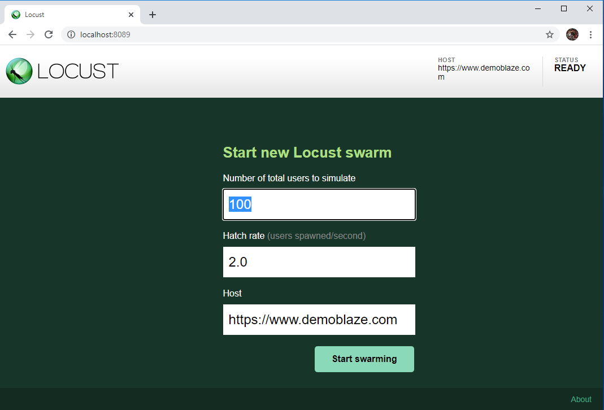
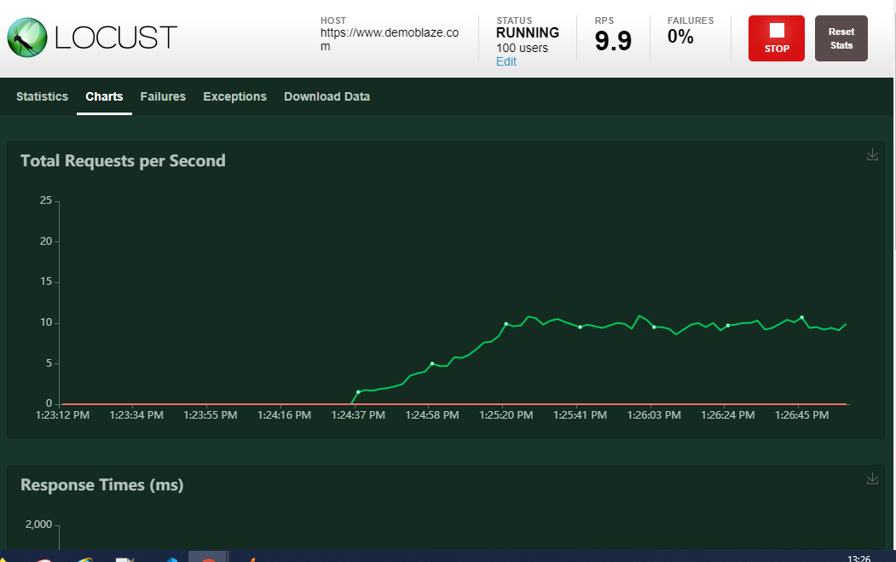
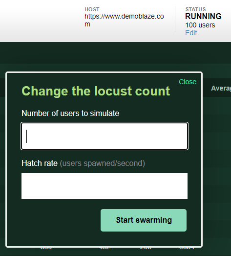
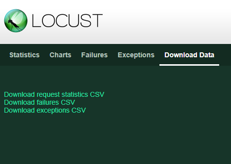

To walk through the features and differences between the two, we’ll make a simple test.

If you don’t have Locust installed, here are the [instructions](https://docs.locust.io/en/latest/installation.html):

## Hello World example
Let’s start with the simplest example - HelloWorld.

A JMeter example might look like this with a thread group, a sampler and a timer.



To do the same thing with Locust you can use any IDE or text editor such as Notepad or vi. In this example, Visual Studio Code is being used.



Our equivalent HelloWorld test using Locust looks like this:
```python
class HelloWorld(HttpUser):
    wait_time = between(5, 15)

    @task
    def test(self):
        self.client.get("/")
```
*The code for this can be found [here](./examples/simple_example.py)

The objects in Locust and JMeter don’t match exactly, but when we added a thread group and an HTTP sampler in JMeter, in Locust we added a class based on HttpUser and a task (which is a function with a @task decorator).

We also added a wait_time which is like a Uniform Random Timer.

### Recording tests
If you are looking for the recorder in Locust, there isn’t one.
However if, like me, you avoid using recorders then this isn’t really a downside. But if you really do want to get a recording as a starting point, then there is a simple way of doing this.

Use the developer tools in your browser to capture what you need and save the recording as a har file.



Convert the har file to a locust file using https://pypi.org/project/har-transformer/

You also might want to consider using a tool like [Fiddler](https://www.telerik.com/fiddler) or [Charles](https://www.charlesproxy.com/) to capture traffic and analyse the requests and responses.

Now let’s look at running the test.

## Running a test
Like JMeter, Locust tests can be run purely from the command line, but by default it has a Flask-based web interface to control and monitor tests as well as download results.

The full details of command line parameters are [here](https://docs.locust.io/en/latest/configuration.html)

To run our test using the web interface:
```python
 locust -f ".\examples\simple_example.py"
```
Then browse the web interface, by default at http://localhost:8089



Here we can set how many users, and the rate to ramp up, which we would have set in the thread group in JMeter. You also set the host here. As with JMeter, you can feed these values in from the command line.

As the test progresses, we can monitor progress in the statistics, charts, failures and exceptions windows.



A nice feature of Locust is being able to dynamically change the number of concurrent users. We can do this by clicking the 'Edit' link and setting the new values.



## Analysing results
In JMeter, we have a number of ways of viewing the results of a test. We can add a listener to view results in the GUI or output to a default listener file which can be used to produce a report or imported to other reporting tools.

In addition to the runtime charts, Locust produces three csv files.


Request statistics CSV is broadly similar to an aggregate listener in JMeter, providing summary information for each task.

The failures and exceptions CSVs provide details of, unsurprisingly, failures and exceptions.

However, if you have been using JMeter for a while, you may have already developed dashboards and reports based on the JMeter format and wish to reuse them.

To get a report similar to the default JMeter listener, with a record for each request made, you can use the jmeter listener plugin from [locust-plugins](https://github.com/SvenskaSpel/locust-plugins/blob/master/locust_plugins/jmeter_listener.py). Note: This does not report status codes (a current limitation in Locust event reporting). If you wish to get the JMeter format with status codes, try [this](https://github.com/howardosborne/locust_jmeter_listener)

To look at other features, let’s take a [more complex example.](./more_complex_example.md)
